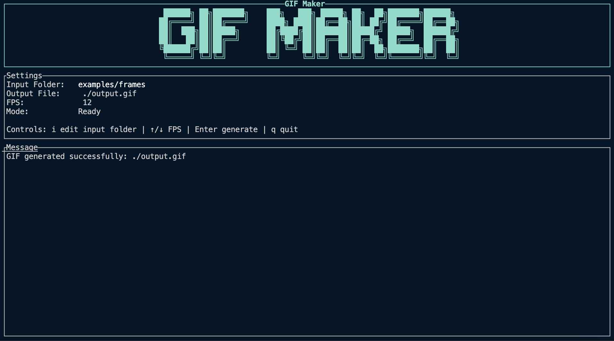

# GIF Maker



[中文文档](README.zh-CN.md)

GIF Maker is a small Rust terminal app for turning a folder of image frames into an animated GIF.
It uses a Ratatui interface for controls, scans local image files, and writes a looping GIF.

## Features

- Reads frames from `example/frames` by default
- Lets you choose a custom input folder from the terminal UI
- Supports `png`, `jpg`, and `jpeg` input files
- Sorts frame files by path before encoding
- Resizes every frame to match the first image
- Encodes an infinitely looping GIF to `./output.gif`
- Lets you adjust FPS from the terminal UI

## Requirements

- Rust toolchain with the 2024 edition support
- A folder of image frames named in sortable order, for example:

```text
example/frames/
  frame_001.png
  frame_002.png
  frame_003.png
```

Use zero-padded file names so the sorted file order matches the intended animation order.

## Usage

Create the default input directory and add frames:

```sh
mkdir -p example/frames
cp /path/to/images/* example/frames/
```

Run the app:

```sh
cargo run
```

Inside the TUI:

| Key | Action |
| --- | --- |
| `i` | Edit the input folder |
| `Up` | Increase FPS |
| `Down` | Decrease FPS |
| `Enter` | Generate the GIF |
| `q` | Quit |

While editing the input folder:

| Key | Action |
| --- | --- |
| Text input | Type the folder path |
| `Backspace` | Delete the previous character |
| `Enter` | Save the input folder |
| `Esc` | Cancel editing |

The generated GIF is written to:

```text
./output.gif
```

## How It Works

The app starts a Crossterm alternate-screen terminal, renders the interface with Ratatui, and handles keyboard input in a simple event loop.

The GIF generation flow is:

1. Scan the selected input folder for supported image files.
2. Sort the frame paths.
3. Decode the first image to determine GIF dimensions.
4. Resize every frame to those dimensions.
5. Encode frames into a looping GIF using the selected FPS.

## Project Structure

```text
src/
  app.rs           App state and FPS controls
  file_scanner.rs  Image discovery and sorting
  gif_encoder.rs   GIF encoding pipeline
  main.rs          Terminal setup and event loop
  tui.rs           Ratatui layout rendering
```

## Development

Run a local check:

```sh
cargo check --all-targets --all-features
```

Format the code:

```sh
cargo fmt
```

Run Clippy:

```sh
cargo clippy --all-targets --all-features -- -D warnings
```

This repository also includes Lefthook configuration for pre-commit checks. See [CONTRIBUTING.md](CONTRIBUTING.md) for setup details.
